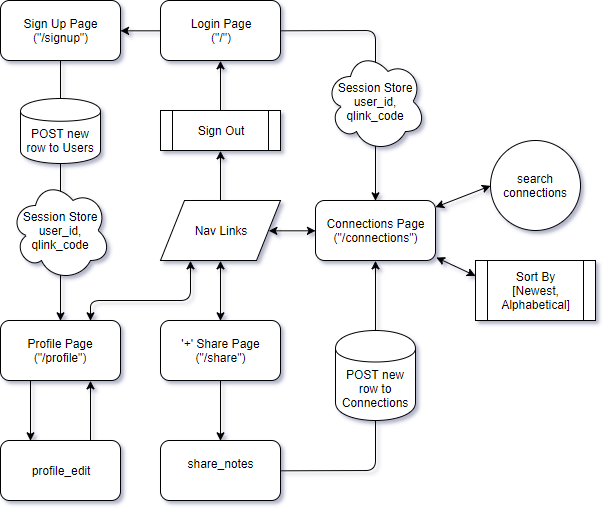

# Qlink - To New Connections
<!-- ------------------------------------------------------------ -->

## Roles
* Andrew Huang: Scrum, Git Guard, Back End
* Ammad Shaikh: QA tests
* Casey Aitken: Back End
* Josie Bellini: Front End

## The Pitch
### HOW MIGHT WE...
> *Make exchanging info with other professionals at an event streamlined and effective, by implementing an application to easily exchange and save business profile information, along with time and date of the meeting.*

## User Stories
### A professional at a meetup/convention/fair:
Mary goes to a meetup for blockchain in her area.
1. WANTS: She would like to be able to network and easily save information about people she meets, without all the fumbling of exchanging emails or business cards. She also wants to make notes about the conversation or other things she learns about her new connections.
2. DOES: She exchanges a generated key with people she meets. After entering the other person's generated key, she can make a quick note about them to save.
### Later...
Mary wants to get in contact with someone she met last week.
1. WANTS: She would like to recall contact info of someone she met at some blockchain meetup a while ago... She would also like to recall what they might have talked about.
2. DOES: She goes to her 'saved', and searches based on what she remembers. She can find contact info, along with where and when she met that person.

## App Functionalities
1. Login for user
2. User Profile: blurb, contact information, professional social links
3. Save connections (in order of most recent), linked to the time and place of meeting, notes, added labels
4. Search contacts by vCard fields, personal notes, by labels

## Tools and Technologies
To build the front end of Qlink, we used HTML5, CSS3, and Bootstrap 4. In the back end, we used MySQL/Sequelize for the database, and Node, Express, and Handlebars for server/middleware.

=================================================================

## Looking Forward
There are a number of functionalities we were unable to implement with the time constraints of the project.
1. _QR Code_. The aim of our application is to make networking at events as painless as possible. In future iterations we would like to build out QR codes to replace the six-digit codes that are currently assigned to users. 
2. _Authorization_. Another goal for future iterations is easier and more secure authorization systems, specifically to build support for signing in with an LinkedIn account.
3. _Geolocation_. Future iterations of Qlink will allow users to access their device's geolocation, and Google Maps API to save a meeting place.
4. _Search Connections_. Currently there is an unimplemented search bar on the Connections view. In future releases, users will be able to search their saved connections by fields, meeting place or time, or personal notes.
5. _Application Walkthrough_. Future releases will also feature an explanation of our application on the home page.
6. _UI Components_. Other visions for future iterations include a unique and identifiable logo, and support for uploading user's profile pictures.

## Links
* [Trello Board](https://trello.com/b/2ntlhcNn/nubc-project-2)
* [GitHub Repository](https://github.com/tinyherocarrot/miniature-succotash)
* [Live on Heroku](https://qlinkconnect.herokuapp.com)
